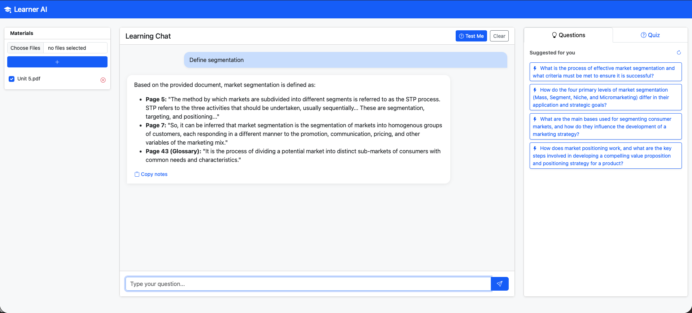

# 🚀 Learner AI: Contextual Study Assistant

Learner AI is a high-performance web application designed to transform how you interact with study materials. By leveraging the **Google Gemini API**, it allows you to upload PDFs, videos, and documents to get contextual notes, interactive quizzes, and smart video navigation.

Imagine having a personal tutor who has read every one of your textbooks, watched every minute of your lecture videos, and is ready to help you 24/7. That is exactly what Learner AI does.

Instead of spending hours flipping through pages or rewinding videos to find a single fact, you just "give" your materials to Learner AI. It then becomes an expert on your specific study content.

There are many AI which can achieve the same but they are like a Search Engine that fills your answer with irrelevant data from the internet unless you are a prompt expert; Learner AI is a Professional Laboratory for your specific learning materials and straight to point.


## ✨ Key Features

- **📂 Multi-Format Support:** Upload PDFs, documents, and videos (MP4/WebM) directly into your study workspace.
- **🧠 Contextual Q&A:** Ask questions about specific materials. The AI understands the context across multiple files.
- **🎥 Smart Video Timestamps:** AI-generated notes include clickable timestamps `[MM:SS]` that jump straight to the relevant part of the video in a floating player.
- **📝 Automated Quizzes:** Generate interactive multiple-choice quizzes from your materials to test your knowledge (Active Recall).
- **💡 Suggested Questions:** Proactive AI suggestions for the most important concepts you should master for any given topic.
- **📱 Local Network Access:** Automatically detects your local IP so you can study on your tablet or phone while running the server on your PC.

## 🛠️ Technology Stack

- **Backend:** FastAPI (Python)
- **Frontend:** Bootstrap 5, Vanilla JavaScript, Marked.js (Markdown Rendering)
- **Database:** SQLite (SQLAlchemy)
- **AI Engine:** Google Gemini 1.5 API

## 🚀 Getting Started

### Prerequisites

- Python 3.9 or higher.
- A Google Gemini API Key. [Get one for free here](https://aistudio.google.com/).

### Installation

1. **Clone the repository:**
   ```bash
   git clone https://github.com/yourusername/learner-ai.git
   cd learner-ai
   ```

2. **Set up a virtual environment:**
   ```bash
   python -m venv venv
   source venv/bin/activate  # On Windows: venv\Scripts\activate
   ```

3. **Install dependencies:**
   ```bash
   pip install -r requirements.txt
   ```

4. **Configure environment variables:**
   Create a `.env` file in the root directory:
   ```env
   GEMINI_API_KEY=your_gemini_api_key_here
   ```

### Running the Application

Start the server using the following command:

```bash
python -m app.main
```

The terminal will display your **Local** and **Network** access URLs. Open them in your browser to start studying!

## 📸 Screenshots




## 🛡️ License

Distributed under the MIT License. See `LICENSE` for more information.

## 🤝 Contributing

Contributions are welcome! Feel free to open an issue or submit a pull request for any improvements or new features.
